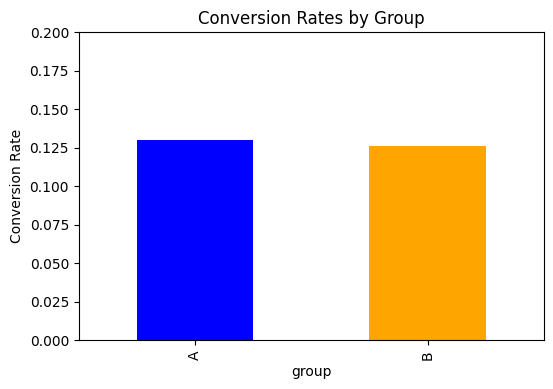

# A/B Testing Analysis Project


**Skills:** Data Analysis, Python, Pandas, Matplotlib, Statsmodels, A/B Testing

---

## Project Overview
This project demonstrates a complete A/B testing workflow using Python and Pandas.  
It simulates an online experiment with **8,000 users** split into **Group A** and **Group B**, analyzing conversion rates and determining statistical significance.

---

## Objectives
- Simulate A/B test dataset
- Perform data cleaning and exploration
- Calculate conversion rates for each group
- Conduct statistical hypothesis testing (Z-test)
- Visualize results for clear interpretation

---

## Tools & Libraries
- Python 3.14  
- Pandas  
- NumPy  
- Statsmodels  
- Matplotlib  

---

## Dataset
- `ab_test_data.csv` contains 8,000 simulated user records  
- Columns:
  - `user_id` → unique user ID  
  - `group` → A/B test group  
  - `converted` → 1 = converted, 0 = did not convert  

---

## Analysis & Results
- **Conversion Rate:**  
  - Group A: 13.0%  
  - Group B: 12.6%  
- **Hypothesis Testing (Z-test):**  
  - Z-statistic: 0.5225  
  - P-value: 0.6013  
  - **Conclusion:** No significant difference between groups  

---

## Visualization

- Group A is **blue**, Group B is **orange**  
- Bar chart shows conversion rates clearly  

---

## How to Run
1. Clone the repository:

```bash
git clone https://github.com/Harshu2326/AB_Test_Project.git
